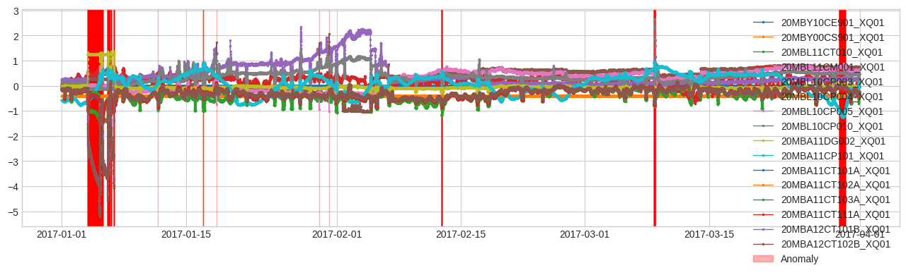

# Детектор выбросов с использованием метода главных компонент (PCA)
Этот Python-пакет предоставляет инструмент для обнаружения выбросов на основе метода главных компонент (PCA) для многомерных временных рядов данных. Он идентифицирует аномальные точки во временном ряде, измеряя ошибку восстановления для каждой временной точки и помечая те, у которых ошибки восстановления значительно превышают норму.

# Обзор
Метод главных компонент (PCA) - это техника снижения размерности, которая может быть применена к многомерным временным рядам данных. В этом детекторе каждая временная точка во временном ряде рассматривается как точка данных в высокоразмерном пространстве. PCA используется для поиска главных компонент этого пространства и проекции данных на более низкоразмерное подпространство. Сравнивая исходные данные с их восстановлением из более низкоразмерного подпространства, можно вычислить ошибку восстановления для каждой временной точки. Точки с ошибками восстановления, превышающими определенный порог, считаются выбросами.

# Составляющие детектора
PCA-трансформер
Этот трансформер выполняет анализ главных компонент (PCA) для многомерных временных рядов данных. Каждая временная точка рассматривается как точка в высокоразмерном пространстве, затем происходит восстановление этих точек с использованием первых k главных компонент, и возвращается ошибка восстановления (т.е. квадрат расстояния между восстановленной точкой и исходной точкой).

Детектор аномалий на основе межквартильного размаха
Этот детектор сравнивает значения временных рядов с первым и третьим квартилями исторических данных и идентифицирует временные точки как аномальные, когда различия выходят за пределы межквартильного размаха (IQR) умноженного на заданный пользователем коэффициент c.
```python
class PcaAD(_TrainableMultivariateDetector):
    """Detector that detects outlier point with principal component analysis.

    This detector performs principal component analysis (PCA) to the
    multivariate time series (every time point is treated as a point in high-
    dimensional space), measures reconstruction error at every time point, and
    identifies a time point as anomalous when the recontruction error is beyond
    anomalously large.

    This detector is internally implemented as a `Pipeline` object. Advanced
    users may learn more details by checking attribute `pipe_`.

    Parameters
    ----------
    k: int, optional
        Number of principal components to use. Default: 1.

    c: float, optional
        Factor used to determine the bound of normal range based on historical
        interquartile range. Default: 5.0.

    Attributes
    ----------
    pipe_: adtk.pipe.Pipenet
        Internal pipenet object.
    """

    def __init__(self, k: int = 1, c: float = 5.0) -> None:
        self.pipe_ = Pipeline(
            [
                ("pca_reconstruct_error", PcaReconstructionError(k=k)),
                ("ad", InterQuartileRangeAD(c=c)),
            ]
        )
        super().__init__()
        self.k = k
        self.c = c
        self._sync_params()

    @property
    def _param_names(self) -> Tuple[str, ...]:
        return ("k", "c")

    def _sync_params(self) -> None:
        self.pipe_.steps[0][1].set_params(k=self.k)
        self.pipe_.steps[1][1].set_params(c=self.c)

    def _fit_core(self, s: pd.DataFrame) -> None:
        self._sync_params()
        self.pipe_.fit(s)

    def _predict_core(self, s: pd.DataFrame) -> pd.Series:
        self._sync_params()
        return self.pipe_.detect(s)
```
# Результат работы метода 


