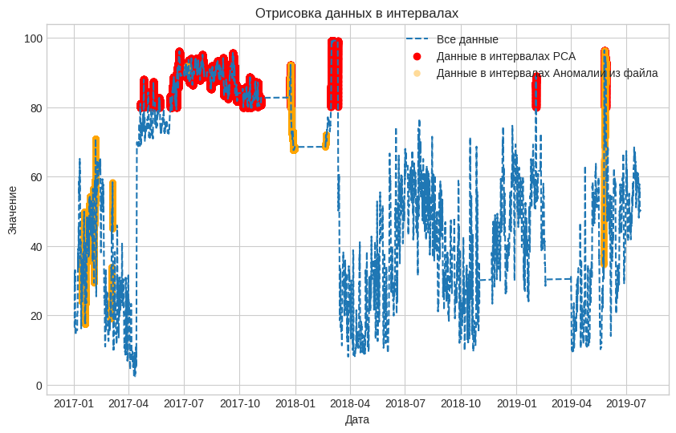

# Метод PCA выход по всем данным

Обучение сети LSTM на данных Yugres с предварительной очисткой.  Реализация алгоритма представлена в [ноутбуке](PCA_ADTK(ALL).ipynb) с пошаговой инструкцией и описанием деталей.

* [Найденые интервалы](intervals_pca.json)
* [Выход сети в csv формате](https://drive.google.com/file/d/1kuZfRtGKk5cJb5fhJxAfmmLRT-zo0tcl/view?usp=drive_link)
