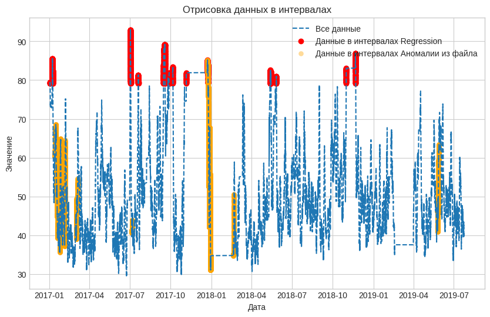

# Метод Regression выход по всем данным

Обучение алгоритма Regression относительно мощности  на данных Yugres с предварительной очисткой.  Реализация алгоритма представлена в [ноутбуке](Regression_ADTK(ALL).ipynb) с пошаговой инструкцией и описанием деталей.

* [Найденые интервалы](intervals_regression.json)
* [Выход сети в csv формате](https://drive.google.com/file/d/1eBCQMNo-2_QW-ruUiJDmhM6ecBX4oXOV/view?usp=sharing)
