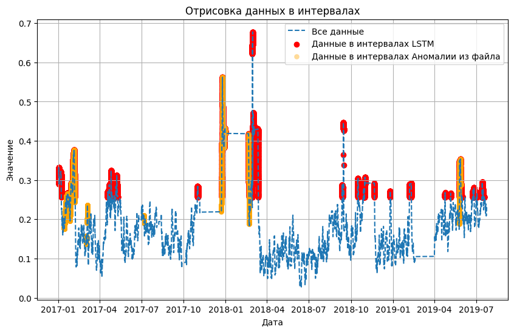

# Метод LSTM обученный на всех данных

Обучение сети LSTM на данных Yugres с предварительной очисткой.  Реализация алгоритма представлена в [ноутбуке](LSTM(ALL).ipynb) с пошаговой инструкцией и описанием деталей.

* [Веса модели](lstm.h5)
* [Найденые интервалы](intervals.json)
* [Выход сети в csv формате](https://drive.google.com/file/d/10a1f6YHpU9t1lSoH0zYDGtmstxVpflaN/view?usp=sharing)
