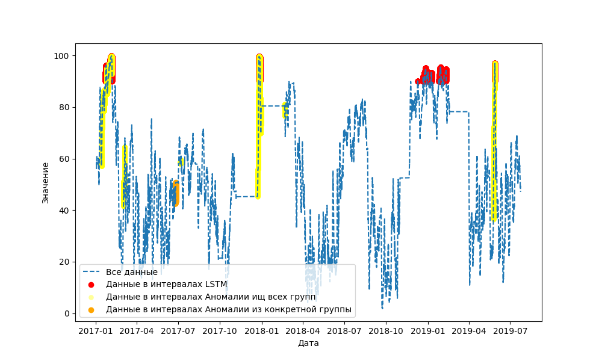
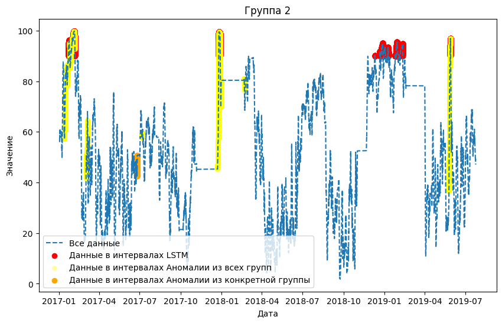
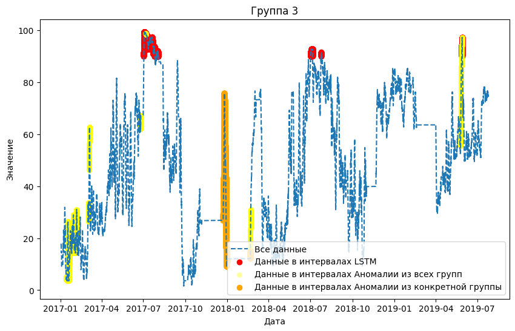
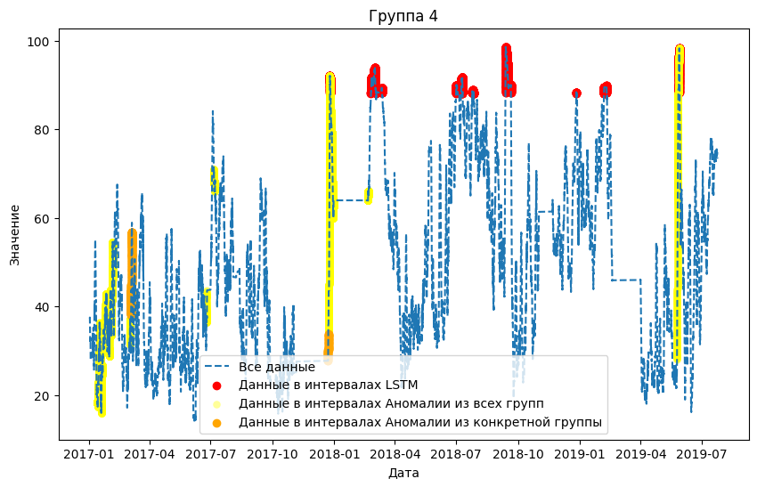
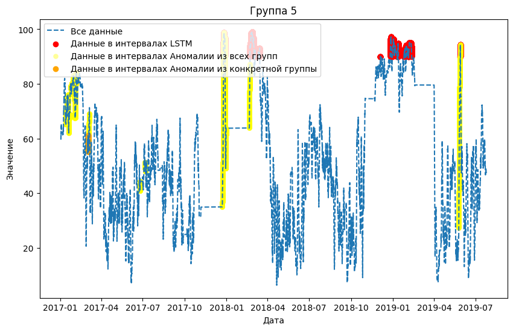
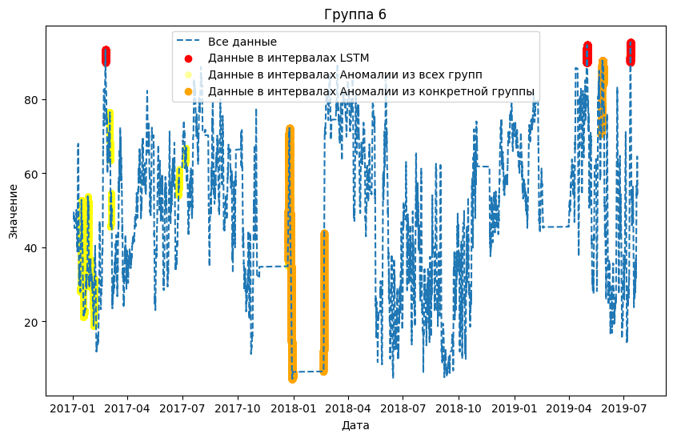
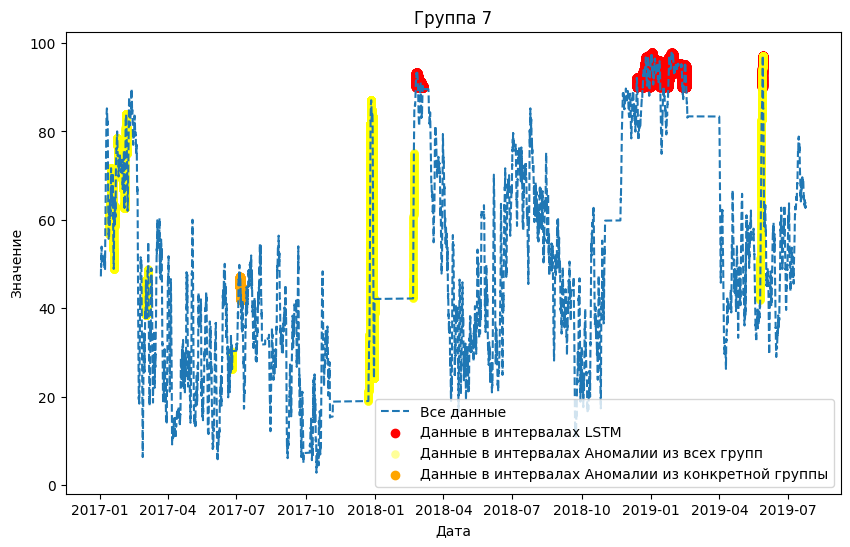
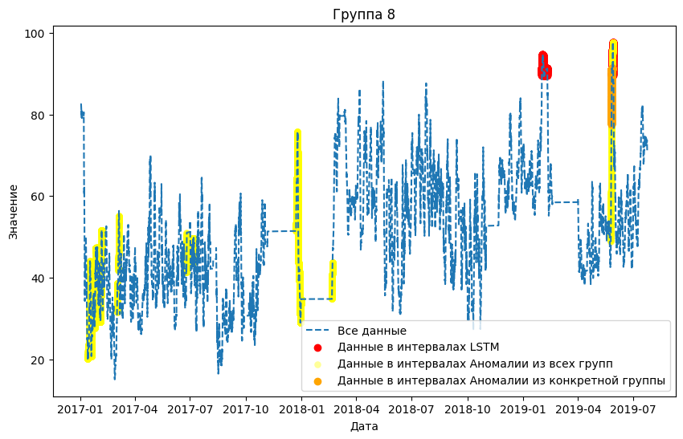
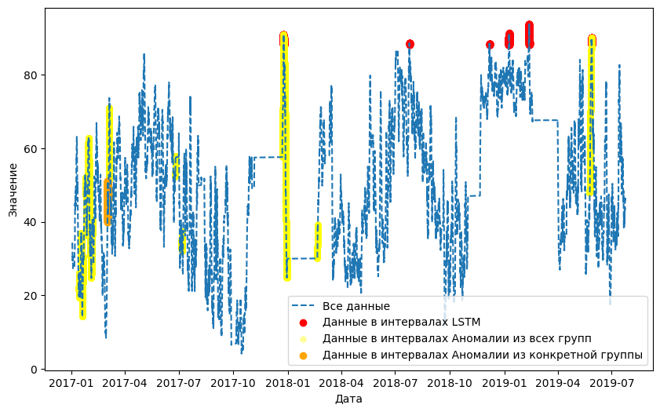

# Метод LSTM обученный по группам

Обучение сети LSTM на данных Yugres с предварительной очисткой.  Реализация алгоритма представлена в [ноутбуке](LSTM_group.ipynb) с пошаговой инструкцией и описанием деталей.

Группа 1.

Группа 2. 

Группа 3. 

Группа 4.

Группа 5.

Группа 6.

Группа 7.

Группа 8.

Группа 9.

* [Графики, веса, выходы сети, интеравалы](https://drive.google.com/drive/folders/1UI6gmSD957oRSmFRbV4ub5j9xrYOKMDG?usp=sharing)

