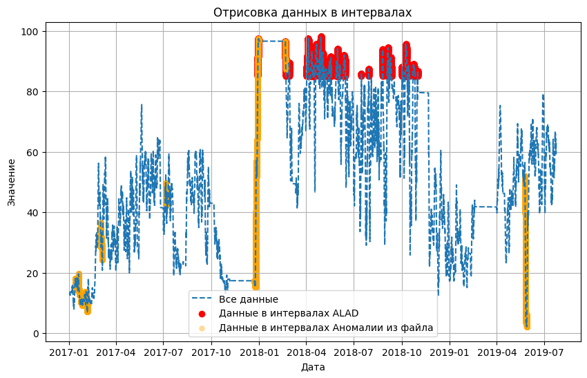

# Метод ECOD обученный на всех данных

Adversarially Learned Anomaly Detection (ALAD) - это метод обнаружения аномалий, основанный на генеративных антагонистических сетях (GAN). 

1. Генеративные антагонистические сети (GAN): ALAD построен на основе структуры GAN, которая включает в себя две нейронные сети - генератор и дискриминатор. Генератор создает данные, в то время как дискриминатор пытается различать реальные данные и данные, созданные генератором.

2. Задача обнаружения аномалий: В ALAD генератор обучается создавать данные, которые похожи на нормальные данные в обучающем наборе, в то время как дискриминатор обучается различать нормальные и аномальные данные. Этот антагонистический процесс помогает модели идентифицировать аномалии на основе отклонений от распределения нормальных данных.

3. Обнаружение аномалий в одном классе: ALAD - это метод обнаружения аномалий в одном классе. Он изучает характеристики нормальных данных и идентифицирует аномалии как данные, существенно отклоняющиеся от изученного распределения нормальных данных.

4. Взаимодействие генератора и дискриминатора: Генератор и дискриминатор работают в тандеме, непрерывно улучшая свою производительность через антагонистический процесс обучения. Генератор стремится создавать данные, которые обманывают дискриминатор, заставляя его классифицировать их как нормальные, в то время как дискриминатор становится более опытным в различении нормальных и аномальных данных.

5. Оценка: После обучения ALAD можно использовать для обнаружения аномалий в новых данных. Точки данных считаются аномалиями, если дискриминатор присваивает им высокий балл аномалии, что указывает на существенное отличие от распределения нормальных данных.

Обучение алгоритма ALAD на данных Yugres с предварительной очисткой.  Реализация алгоритма представлена в [ноутбуке](ALADclear(all).ipynb) с пошаговой инструкцией и описанием деталей.

* [Найденые интервалы](intervals_ALAD.json)
* [Выход сети в csv формате](pyOD_ALAD.csv)
