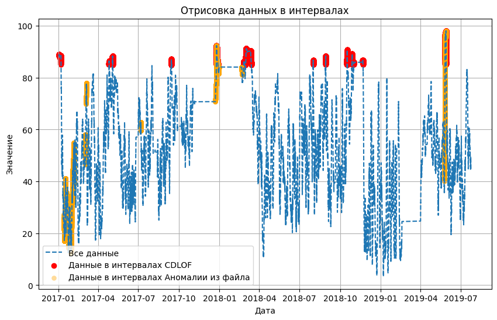

# Метод CDLOF обученный на всех данных

Clustering-Based Local Outlier Factor (CBLOF) - это метод обнаружения выбросов, который комбинирует принципы кластеризации и оценки локальных факторов (Local Outlier Factor, LOF). Этот метод позволяет выявлять выбросы в данных, основываясь на их аномальности относительно своего окружения в пространстве признаков.

Вот основные характеристики и принципы работы метода CBLOF:

1. Оценка локальной аномальности: CBLOF работает, оценивая локальную аномальность каждой точки данных. Это означает, что он учитывает окружение каждой точки признаков для определения, насколько аномальной она является в своем собственном контексте.

2. Кластеризация данных: Сначала данные кластеризуются на более мелкие группы (кластеры) с помощью алгоритма кластеризации, такого как k-Means. Кластеризация позволяет выделить структуру данных и позволяет более эффективно оценивать локальную аномальность.

3. Оценка LOF для кластеров: Для каждого кластера рассчитывается Local Outlier Factor (LOF), который измеряет, насколько аномальны точки внутри кластера по сравнению с точками в окружающих кластерах. LOF оценивает плотность данных в окружающем пространстве признаков.

4. Комбинация LOF для точек данных: LOF для каждой точки данных комбинируется с учетом их принадлежности к кластерам и их расстояния до центра своего кластера. Это позволяет оценить аномальность точек данных, учитывая их окружение в пространстве признаков и кластеризацию.

5. Пороговое значение: CBLOF может быть настроен с помощью порогового значения, чтобы классифицировать точки данных как аномальные или нормальные на основе их оценок. Точки с LOF, превышающим заданный порог, считаются аномальными.

Обучение алгоритма ALAD на данных Yugres с предварительной очисткой.  Реализация алгоритма представлена в [ноутбуке](CBLOF(all).ipynb) с пошаговой инструкцией и описанием деталей.

* [Найденые интервалы](intervals_CDLOF.json)
* [Выход сети в csv формате](pyOD_CDLOF.csv)
