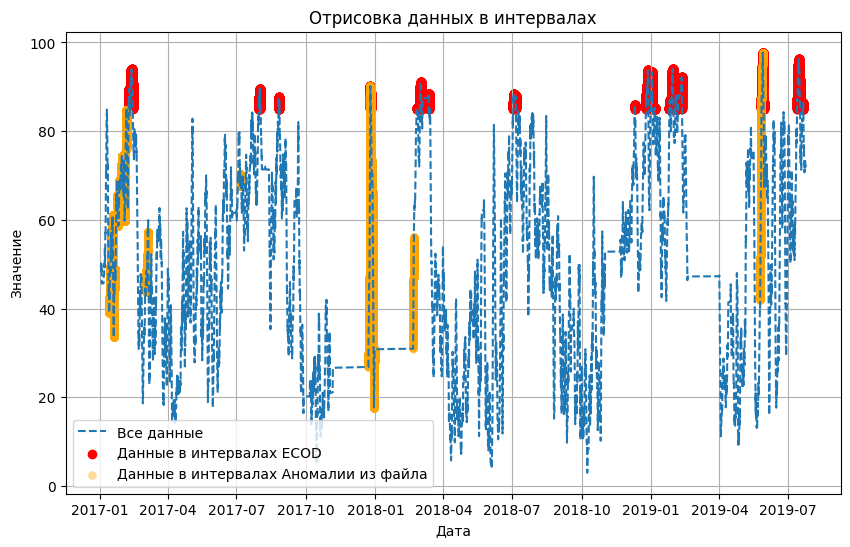

# Метод ECOD обученный на всех данных

ECOD (Unsupervised Outlier Detection Using Empirical Cumulative Distribution Functions) - это метод и техника для выявления выбросов или аномалий в наборе данных. Выбросы - это точки данных, которые существенно отличаются от большинства точек данных в наборе и могут указывать на ошибки, необычное поведение или интересные закономерности в данных.

ECOD - это метод без учителя, что означает, что он не зависит от размеченных данных (точек данных, помеченных как нормальные или выбросы). Вместо этого он использует понятие эмпирической накопительной функции распределения (Empirical Cumulative Distribution Function, ECDF) для выявления выбросов. Вот обзор того, как работает ECOD:

1. Эмпирическая накопительная функция распределения (ECDF): ECDF - это статистический концепт, используемый для описания распределения данных в наборе данных. Он вычисляет накопительное распределение вероятностей точек данных. Для каждой точки данных ECDF указывает вероятность того, что случайная выборка из набора данных будет меньше или равна этому значению.

2. Выявление выбросов с помощью ECOD: ECOD использует ECDF для обнаружения выбросов. Основная идея заключается в том, что выбросы будут иметь существенно отличающуюся ECDF по сравнению с остальными данными. Это происходит потому, что они имеют экстремальные значения, которые отклоняются от ожидаемого распределения.

3. Сравнение ECDF: ECOD сравнивает ECDF каждой точки данных с общим ECDF набора данных. Он ищет точки данных с ECDF, которые сильно отклоняются от ожидаемого кумулятивного распределения. Эти отклонения указывают на потенциальные выбросы.

Оценка и ранжирование: ECOD присваивает оценку каждой точке данных на основе степени отклонения ее ECDF от ожидаемой ECDF. Точки данных с наивысшими оценками считаются наиболее вероятными выбросами.

Обучение алгоритма ECOD на данных Yugres с предварительной очисткой.  Реализация алгоритма представлена в [ноутбуке](ECOD(ALL).ipynb) с пошаговой инструкцией и описанием деталей.

* [Найденые интервалы](intervals.json)
* [Выход сети в csv формате](https://drive.google.com/file/d/1ShbKY6RwuO8FTVc8wsTKn_jfA_jv-1qd/view?usp=share_link)
